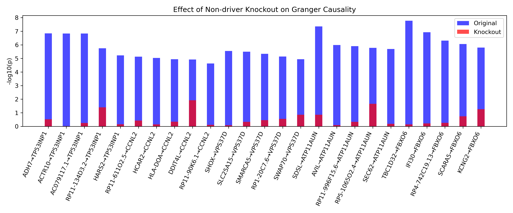

# ***CancerTrace***: Multi-Stage Single-Cell Analysis of Networked Cancer Evolution for Driver and Modulator Gene Identification 

CancerTrace is a computational framework designed to identify cancer driver genes and their upstream regulators from longitudinal single-cell RNA sequencing (scRNA-seq) datasets. By integrating patient-specific, time-resolved data, CancerTrace enables dynamic mapping of gene regulatory networks

## Features
- 🔎 Identify cancer-originating clusters from longitudinal scRNA-seq data  
- 🧬 Reconstruct time-resolved gene regulatory networks using **Transfer Entropy** + **Sparse Precision Matrix Inference**  
- 📊 Quantify causal influence of non-driver → driver genes with **Bayesian Logistic Modeling**  
- 🛠 Variational Bayesian inference ensures robust predictions  
- 📈 Rank both known and novel driver genes across multiple tumor stages  
- 🌐 Reveal upstream modulators and regulatory hierarchies in tumor progression  

## Dataset
- 9 longitudinal scRNA-seq datasets  
- 3 LUAD patients (Normal → Early → Mid → Late stages)  
- Patient-specific cell states preserved across time  

## Validation
- ✅ Cross-validation and ROC analysis for predictive accuracy  
- 🔄 In silico perturbation for functional relevance  
- 📚 More than half genes matches literature-reported oncogenes & tumor suppressors  

$~~$

## Executing the CancerTrace Algorithms
Example run scripts are located in the Run/ folder. 
They demonstrate how to execute both pipelines using example data and visualize key outputs. 

**Usage: R script for algorithm 2**  
   Run/RUNcancertrace_algorithm_2.R 

**Usage: Python script for algorithm 2**  
***Execute in the terminal*** 
   ./run_algorithm_2.py --in1 data/epithelial.level.time1.csv 
                     --in2 data/epithelial.level.time2.csv  
                     --in3 data/epithelial.level.time3.csv 
                     --outpng data/algorithm2_top20.png 

This script:  
1.	Loads stage-ordered epithelial datasets (time1, time2, time3).  
2.	Runs Algorithm 2 on each gene to estimate the driver effect coefficient (dr.coef).  
3.	Outputs a ranked gene table and a bar plot of the top 20 genes 

$~~$
**Run cancertrace_algorithm_3 — Dynamic Causal Inference** 

- **R Script**: Run/RUNcancertrace_algorithm_2.R  
- **Python Script**: python3 run_algorithm_3.py  

$~~$

This script:  
1.	Loads the same stage-ordered data.  
2.	Runs Algorithm 3, which constructs a time-densified expression matrix, infers causal gene-gene influences, and performs knockout Granger-causality analysis.  
3.	Produces a summary of top modulators per driver and a bar chart comparing −log10 (p-values) before vs after knockout.  
Output:  
- CIS_matrix — non-driver → driver causal scores 
- top_influencers — top modulators for each driver 
- knockout_results.table — combined knockout statistics 
- Knockout_Effect.png — plot of original vs knockout significance 

