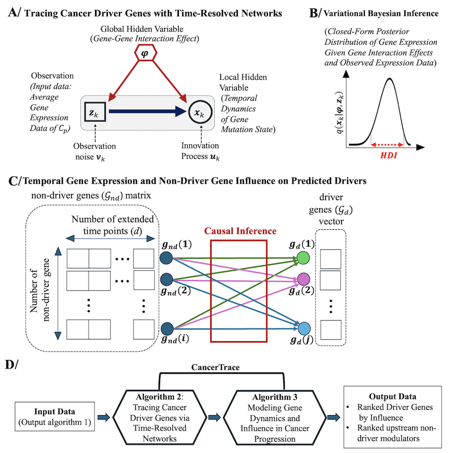

# CancerTrace: Multi-Stage Single-Cell Analysis of Networked Cancer Evolution for Driver and Modulator Gene Identification 

CancerTrace is a computational framework designed to identify cancer driver genes and their upstream regulators from longitudinal single-cell RNA sequencing (scRNA-seq) datasets. By integrating patient-specific, time-resolved data, CancerTrace enables dynamic mapping of gene regulatory networks

## Features
- 🔎 Identify cancer-originating clusters from longitudinal scRNA-seq data  
- 🧬 Reconstruct time-resolved gene regulatory networks using **Transfer Entropy** + **Sparse Precision Matrix Inference**  
- 📊 Quantify causal influence of non-driver → driver genes with **Bayesian Logistic Modeling**  
- 🛠 Variational Bayesian inference ensures robust predictions  
- 📈 Rank both known and novel driver genes across multiple tumor stages  
- 🌐 Reveal upstream modulators and regulatory hierarchies in tumor progression  

## Dataset
- 9 longitudinal scRNA-seq datasets  
- 3 LUAD patients (Normal → Early → Mid → Late stages)  
- Patient-specific cell states preserved across time  

## Validation
- ✅ Cross-validation and ROC analysis for predictive accuracy  
- 🔄 In silico perturbation for functional relevance  
- 📚 More than half genes matches literature-reported oncogenes & tumor suppressors  

$~~$

## Steps in the CancerTrace Framework 

$~~$

# Run CancerTrace

#--------------- 
**R Packages** 
#--------------- 
libs <- c("MASS", "tidyr", "dplyr", "caret", "viridis", "magrittr", "plyr", "vars", "tidyverse", "reshape2", "zoo") 
lapply(libs, library, character.only=TRUE) 

#--------------- 
**load output data of algorithm 1** 
#--------------- 
load("dataset/epithelial.level.time1.rdata") 
load("dataset/epithelial.level.time2.rdata") 
load("dataset/epithelial.level.time3.rdata") 

#--------------- 
**load genes id** 
#--------------- 
load("gene.id.rdata") 

#--------------- 
**call function of algorithm 2** 
#--------------- 
source("Algorithm/algorithm_2.R") 
epithelial.gene.level <- cbind(epithelial.level.time1$level_1, epithelial.level.time2$level_2, epithelial.level.time3$level_3) 
epithelial.gene.level <- data.frame(epithelial.gene.level) 

epithelial.gene <- lapply(1:dim(epithelial.gene.level)[1], function(w) {algorithm_2(epithelial.gene.level[w,])})  
dr.coef <- sapply(1:dim(epithelial.gene.level)[1], function(m) {epithelial.gene[[m]]$driver.effect}) 

gene.dr <- cbind(gene.id[1:5,], dr.coef) 
colnames(gene.dr) <- c("gene_id", "coef_dr") 
gene.dr <- data.frame(gene.dr) 
gene.dr <- gene.dr[order(gene.dr$coef_dr, decreasing = TRUE), ] 

#--------------- 
**call function of algorithm 3** 
#--------------- 
source("Algorithm/algorithm_2.R") 

################ 
***run the function generate_evolved_matrix*** 
################ 
num_data <- generate_evolved_matrix( 
  df1 = Epithelial.level.time1, col1 = "level_1", 
  df2 = Epithelial.level.time2, col2 = "level_2", 
  df3 = Epithelial.level.time3, col3 = "level_3", 
  noise_sd = 0.1, 
  seed = 42 
) 

################ 
***run the function compute_CIS_matrix*** 
################ 
genes <- Epithelial.level.time1$gene 
rownames(num_data) <- genes 
driver_genes <- c("CA12", "LINC01620", "FKRP", "GPX1", "RP11-146F11.1") 
non_driver_genes <- setdiff(rownames(num_data), driver_genes) 
CIS_matrix <- compute_CIS_matrix(num_data, non_driver_genes, driver_genes)  

################ 
***run the function get_top_influencers_per_driver*** 
################ 
top_influencers <- get_top_influencers_per_driver(CIS_matrix, top_n = 5) 

################ 
***run the function compute_transformation_likelihood*** 
################ 
likelihood_output <- compute_transformation_likelihood(CIS_matrix, driver_genes, rownames(num_data))  
likelihood_df <- likelihood_output$model_df 

################ 
***run the function evaluate_model_performance*** 
################ 
auc_mean <- evaluate_model_performance(likelihood_df) 

